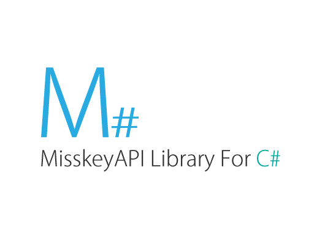

# Installation
1. Into MSharp projectfile for your solution
2. Click "Enable NuGet package restore" in context menu of solution
3. Done
# Usage
Please read sample.
# Contribution
We welcome your contribution.
# License
Released under the MIT License, see [LICENSE](LICENSE).